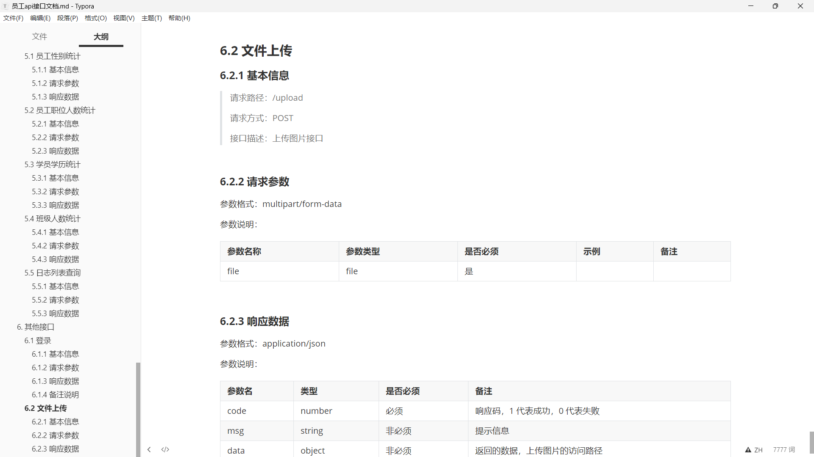
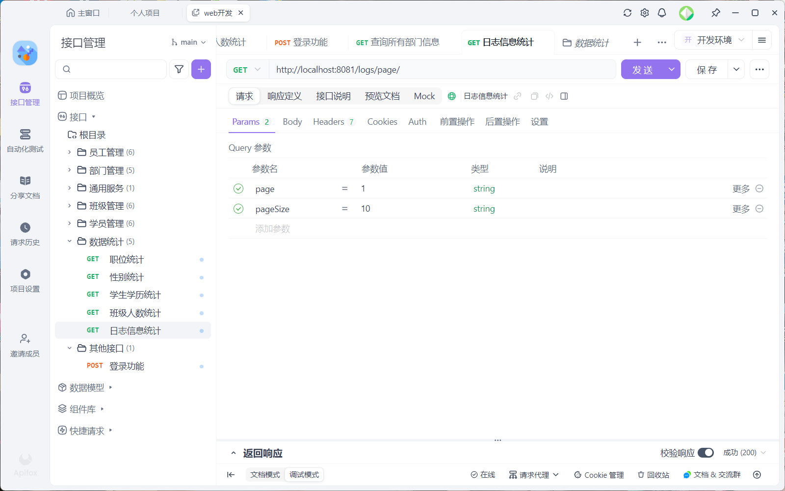
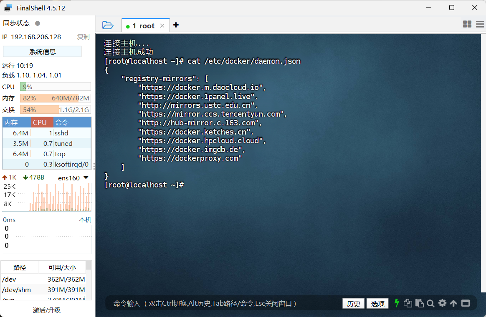
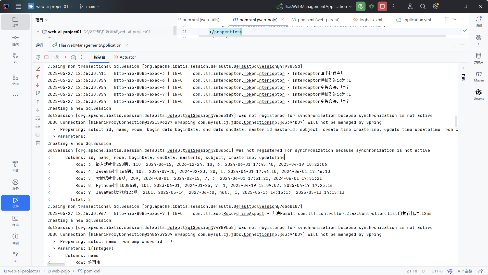
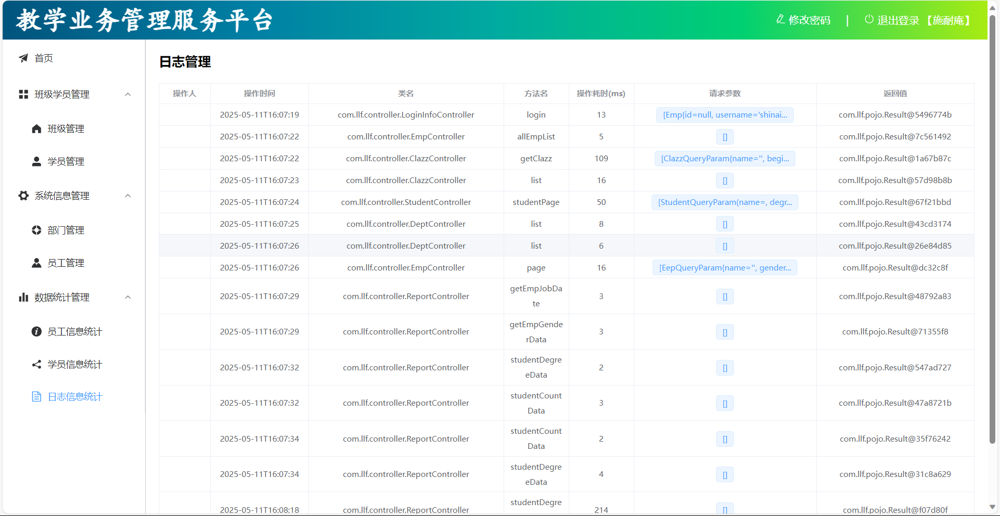

<<<<<<< HEAD
# README

# 📚一、介绍

🎯这是我大二期间独立完成开发的教学业务管理服务平台

🎯根据接口文档，独立按照需求开发、测试对应功能接口

🎯借助Apifox完成前后端联调测试，测试对应功能接口的是否能正常使用

# 📚二、技术与功能

**🚀功能**

- 使用springAOP技术完成记录系统的操作日志，并展示到前端
- 使用拦截器Interceptor或过滤器Filter完成登录校验功能
- 利用阿里云OSS完成图片的上传操作
- 利用JWT完成token的生成与解析
- 利用全局异常处理器或自定义异常集中、精准处理异常信息

**🔧技术**

- 使用springboot框架开发
- 使用mybatis简化对MySQL数据库的访问操作
- 在Linux中使用docker容器化部署前后端项目
- 使用Maven进行依赖管理

# 📚三、问题及解决

**问题：** 学习过程中碰到的最大问题就是自己的版本与学习对象的**版本不一致**所带来的**各种问题**，如在使用docker时碰到的Docker Hub 访问受限、所使用的CentOS对docker的支持不足无法等。

**解决：** 主动查找各种形式的资源，搜索可使用的docker镜像源，并配置到/etc/docker/daemon.json成功解决。因为CentOS8以及提前停止支持，因此后续打算换成Ubuntu 24.04 LTS继续完成后续学习及开发。

# 📚四、其他

**项目部分截图展示**

**后续学习计划**

📜开发校园交易平台

📜引入智能AI客服系统
